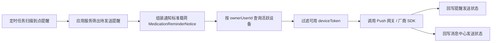

# 用药提醒后端 Push 链路 Demo 学习文档

## 1. 这份文档解决什么问题

你这次想看的不是“前端收到通知以后怎么展示”，而是“为什么明明是用药提醒，最后却是后端主动把 Push 发出去”。

当前项目里的真实链路确实是后端发起，核心原因有三点：

1. 提醒是否到点，判断依据在后端数据库里的 `scheduled_time`
2. 到点后是否还能重试、是否要记录失败原因，也要由后端统一控制
3. 用户可能绑定多台设备，真正发给哪些 `deviceToken`，需要后端按账号查设备表来决定

所以完整链路不是“App 本地自己闹钟提醒”，而是：



## 2. 真实生产代码的对应位置

这次 demo 是按下面三段真实代码抽出来的：

1. 调度入口：`healthtrail-api/src/main/java/com/healthtrail/api/schedule/MedicationReminderScheduleJob.java`
2. 应用服务：`healthtrail-domain/src/main/java/com/healthtrail/domain/health/medication/MedicationApplicationService.java`
3. Push 发送器：`healthtrail-domain/src/main/java/com/healthtrail/domain/health/medication/notify/AppPushMedicationReminderNotifier.java`

你可以按这个阅读顺序理解：

### 2.1 调度层做什么

`MedicationReminderScheduleJob.dispatchDueReminders()` 的职责非常单纯：

1. 每分钟触发一次
2. 读取批大小和最大重试次数
3. 调用 `medicationApplicationService.dispatchDueReminders(...)`

这里它不关心设备表，不关心 token，也不关心 Push 厂商。  
调度层只负责“到时间了，开始派发”。

### 2.2 应用服务做什么

`MedicationApplicationService.dispatchDueReminders(...)` 是整条链路真正的中枢：

1. 查询 reminder 表里“已到点、提醒状态还是待处理、发送状态是待发送或失败、重试次数没超限”的记录
2. 按 `scheduled_time` 排序后逐条处理
3. 每条提醒先组装成 `MedicationReminderNotice`
4. 先创建或复用消息中心记录
5. 调用 `medicationReminderNotifier.notify(notice)`
6. 根据结果回写提醒表的 `notify_status`、`notify_time`、`notify_retry_count`、`notify_fail_reason`

这一层是业务规则最重的地方。  
你可以把它理解成“提醒派发总控台”。

### 2.3 Push 发送器做什么

`AppPushMedicationReminderNotifier.notify(...)` 做的事情是：

1. 根据 `ownerUserId` 查这个用户的活跃设备
2. 过滤 `status = ENABLE`
3. 再过滤 `deviceToken` 不为空
4. 如果一个都没有，直接返回失败
5. 如果有设备，则调用 `HealthExternalPushGatewayClient`
6. 如果外部网关没启用，则走日志模拟发送

注意这里非常关键的一点：

后端不是把提醒“发给用户”这么抽象，而是把提醒“发给用户当前绑定的多个设备 token”。

## 3. 设备 token 是怎么进入这条链路的

Push 能不能发出去，前提是设备先注册。

真实代码对应关系如下：

1. `AppDeviceController`：暴露 App 注册、查询、停用设备接口
2. `AppDeviceApplicationService.registerDevice(...)`：把 `deviceCode / ownerUserId / pushPlatform / deviceToken` 绑定起来
3. `HealthAppDeviceServiceImpl.listActiveDevices(ownerUserId)`：发送前按账号查询活跃设备

这意味着：

1. App 第一次拿到 token，要调用注册接口上报
2. token 刷新了，也要重新上报
3. 用户退出登录或关闭通知时，要把设备停用
4. 后端真正派发提醒时，再根据用户当前有效设备决定发给谁

## 4. 这次新增的独立 Demo 在哪里

新增文件：

`healthtrail-domain/src/test/java/com/healthtrail/domain/health/medication/demo/MedicationReminderPushChainDemoTest.java`

这个 demo 的设计目标是：

1. 不依赖数据库
2. 不依赖 Redis
3. 不依赖外部 Push 平台
4. 但保留和生产链路同样的职责拆分

它把链路拆成了这些角色：

1. `MedicationReminderScheduleJobDemo`
2. `MedicationApplicationServiceDemo`
3. `AppDeviceApplicationServiceDemo`
4. `AppPushMedicationReminderNotifierDemo`
5. `FakePushGatewayClient`
6. `InMemoryMedicationReminderRepository`
7. `InMemoryAppDeviceRepository`
8. `InMemoryAppMessageRepository`

## 5. Demo 演示了哪几个关键场景

### 场景 A：有活跃设备，提醒成功派发

用户 `1001` 先注册两台设备：

1. `device-a-1`
2. `device-a-2`

然后创建一条已经到点的提醒。  
调度执行后，这条提醒会成功派发到两台设备。

这个场景帮你理解：

1. 为什么一条提醒可能对应多个 Push
2. 为什么发送器要查设备表而不是直接发一条固定消息

### 场景 B：用户存在设备记录，但没有活跃 token，提醒失败

用户 `2002` 先注册设备，再停用设备。  
这时数据库里有设备记录，但它已经不是可发状态。

调度执行后：

1. 该提醒仍然会被扫出来
2. 但通知器查不到可用 token
3. 发送结果会失败
4. `notifyRetryCount` 会加 1
5. `notifyFailReason` 会写成“当前用户没有可用的活跃设备Token”

这个场景帮你理解：

“有设备记录”不等于“有可发 Push 的设备”。

### 场景 C：补注册设备后，失败提醒被重试成功

第二轮里重新给 `2002` 注册一个新设备：

1. `device-b-2`
2. `token-b-new`

再执行一次调度：

1. 应用服务会再次扫到上一次失败但未超重试次数的提醒
2. 同一条消息中心记录会被复用
3. 这次因为有活跃 token，所以发送成功
4. `notifyFailReason` 会被清空

这个场景帮你理解：

后端不是“失败就结束”，而是可以靠定时任务持续重试，直到成功或超过阈值。

### 场景 D：未到点提醒不会被扫描

demo 里有一条 `scheduledTime` 还在未来的提醒。  
它不会进入本轮派发列表。

这个场景对应真实系统里“定时任务只处理已经到提醒时间的数据”。

### 场景 E：已达到最大重试次数的提醒不会无限重试

demo 里还有一条已经失败 3 次的提醒，而调度最大重试次数也是 3。  
因此它会被跳过。

这个场景对应真实系统里避免死循环重试的保护逻辑。

## 6. Demo 和生产代码的对照关系

| 生产角色 | Demo 角色 | 作用 |
| --- | --- | --- |
| `MedicationReminderScheduleJob` | `MedicationReminderScheduleJobDemo` | 定时触发派发 |
| `MedicationApplicationService` | `MedicationApplicationServiceDemo` | 筛选到点提醒并逐条派发 |
| `MedicationReminderNotice` | `MedicationReminderNoticeDemo` | 标准通知载荷 |
| `AppDeviceApplicationService` | `AppDeviceApplicationServiceDemo` | 注册/停用设备 |
| `AppPushMedicationReminderNotifier` | `AppPushMedicationReminderNotifierDemo` | 按用户设备推送 |
| `HealthExternalPushGatewayClient` | `FakePushGatewayClient` | 模拟 Push 发送出口 |
| 提醒表 | `InMemoryMedicationReminderRepository` | 存提醒状态 |
| 设备表 | `InMemoryAppDeviceRepository` | 存设备与 token |
| 消息中心表 | `InMemoryAppMessageRepository` | 记录发送轨迹 |

## 7. 怎么运行这个 Demo

在后端根目录执行：

```bash
mvn -pl healthtrail-domain -Dtest=MedicationReminderPushChainDemoTest test
```

如果你想边读边看，推荐顺序是：

1. 先看测试方法 `shouldRunCompleteBackendPushChainWithRetry()`
2. 再看 `MedicationReminderScheduleJobDemo`
3. 再看 `MedicationApplicationServiceDemo`
4. 再看 `AppPushMedicationReminderNotifierDemo`
5. 最后看三个内存仓库

这样阅读会最接近真实请求流转顺序。

## 8. 学这条链路时，最值得抓住的 5 个重点

1. 提醒是否到点，是后端根据 reminder 表判断，不是 App 本地说了算
2. 真正的 Push 目标是设备 token，不是抽象的用户 ID
3. 发送器只关心通知载荷和设备列表，不应该直接操心业务调度
4. 失败要记录原因和重试次数，否则上线后很难排查“为什么用户没收到提醒”
5. 消息中心和 Push 发送虽然相关，但不是一回事，通常要分别记录结果

## 9. 你下一步如果要继续深挖，建议按这个顺序

1. 对照看生产代码里的 `dispatchSingleReminder(...)`
2. 再看 `buildReminderNotice(...)` 和 `buildReminderPushPayload(...)`
3. 然后看 `AppDeviceController` 的注册/停用接口
4. 最后看 `HealthExternalPushGatewayClient`，理解真正接厂商网关时的 HTTP 请求格式

## 10. 一句话总结

这套提醒通知链路的本质是：

**后端定时扫到点提醒 -> 应用服务挑出可发记录 -> 根据用户活跃设备查 token -> 调用 Push 通道发送 -> 再把成功/失败结果回写。**
